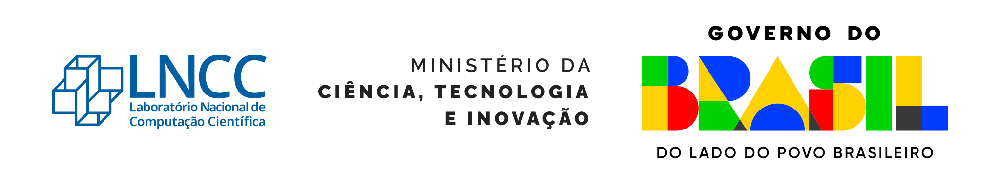

# aulas-implementacao-mef

Repositório com notebooks didáticos para aulas de implementação de métodos de
elementos finitos na disciplina GA-020 do LNCC.

O material está organizado em duas implementações paralelas:

- `notebooks/fenics/`: notebooks em FEniCSx, usando a interface atual
  `dolfinx`.
- `notebooks/firedrake/`: notebooks em Firedrake, mantidos como contraparte
  conceitual dos exemplos em FEniCSx.

A sequência foi organizada para que cada aula apresente a forma forte, a forma
fraca, a escolha dos espaços discretos, a montagem computacional e um
diagnóstico numérico simples.

## Objetivos

- Manter exemplos de elementos finitos executáveis do começo ao fim.
- Comparar implementações equivalentes em Firedrake e FEniCSx/dolfinx.
- Usar notebooks como material de aula, com explicações passo a passo.
- Facilitar a reprodução do ambiente FEniCSx com Pixi.
- Preservar os notebooks em pares `.ipynb` e `.py` via Jupytext.

## Estrutura do repositório

- `pixi.toml`: define dependências, ambientes e tarefas do projeto.
- `pixi.lock`: registra as versões resolvidas das dependências Pixi.
- `jupytext.toml`: configura o pareamento entre `.ipynb` e `.py:percent`.
- `scripts/sync_notebooks.py`: sincroniza notebooks usando Jupytext.
- `notebooks/fenics/`: aulas em FEniCSx/dolfinx.
- `notebooks/firedrake/`: aulas em Firedrake.

## Notebooks disponíveis

Cada pasta (`fenics` e `firedrake`) contém a mesma sequência:

- `00-introducao-fem-*.ipynb`: organização do material e teste de importação.
- `01-poisson-*.ipynb`: problema de Poisson primal com solução manufaturada.
- `02-elasticidade-linear-*.ipynb`: elasticidade linear em deslocamentos.
- `03-equacao-calor-*.ipynb`: equação do calor com Euler implícito.
- `04-gray-scott-*.ipynb`: reação-difusão de Gray-Scott com sistema acoplado
  não linear e evolução espaço-tempo.

Os notebooks também incluem gráficos simples para visualização de soluções,
componentes, erros e diagnósticos transientes.

## Ambientes

O Pixi gerencia o ambiente FEniCSx/dolfinx:

- `default`: ambiente base com Jupyter, Jupytext, NumPy, SciPy, Pandas,
  Matplotlib, Seaborn e ferramentas de formatação.
- `fenics-env`: ambiente `default` mais `fenics-dolfinx`.

Firedrake deve ser instalado e ativado separadamente. Consulte as instruções
oficiais em:

<https://www.firedrakeproject.org/install.html>

## Como usar os notebooks FEniCSx/dolfinx

### 1. Instale o Pixi

Siga a documentação oficial:

<https://pixi.prefix.dev/latest/installation/>

Depois da instalação, confira:

```sh
pixi --version
```

### 2. Clone o repositório

```sh
git clone https://github.com/lncc-ga020/aulas-implementacao-mef.git
cd aulas-implementacao-mef
```

### 3. Instale as dependências Pixi

```sh
pixi install --frozen
```

### 4. Abra os notebooks FEniCSx

```sh
pixi shell -e fenics-env
jupyter lab
```

Depois, abra os notebooks em `notebooks/fenics/`.

## Como usar os notebooks Firedrake

Ative o ambiente Firedrake instalado no seu computador. Por exemplo, se o
ambiente estiver em `~/firedrake/venv-firedrake`:

```sh
source ~/firedrake/venv-firedrake/bin/activate
jupyter lab
```

Depois, abra os notebooks em `notebooks/firedrake/`.

Se o ambiente Firedrake não tiver Jupyter instalado, uma alternativa é ativar o
ambiente e executar a versão `.py` pareada do notebook:

```sh
python notebooks/firedrake/01-poisson-firedrake.py
```

## Fluxo de trabalho recomendado

Antes de editar notebooks, atualize o repositório:

```sh
git pull
```

Para editar ou executar notebooks FEniCSx:

```sh
pixi shell -e fenics-env
jupyter lab
```

Ao terminar alterações, sincronize os notebooks e rode as verificações:

```sh
pixi run precommit-sync
```

## Tarefas Pixi úteis

Lista os notebooks encontrados em `notebooks/`:

```sh
pixi run notebooks-smoke
```

Sincroniza notebooks `.ipynb` com Jupytext:

```sh
pixi run notebooks-sync
```

Executa as verificações do `pre-commit`:

```sh
pixi run precommit
```

Sincroniza notebooks e executa as verificações:

```sh
pixi run precommit-sync
```

## Jupytext

Os notebooks são mantidos em pares:

- `.ipynb`: arquivo aberto no JupyterLab ou VS Code.
- `.py`: representação textual em formato percent, mais adequada para revisão
  em Git.

A configuração está em `jupytext.toml`:

```toml
formats = "ipynb,py:percent"
```

## Pontos de atenção numérica

- Os notebooks usam malhas pequenas para rodar rapidamente em aula.
- Os diagnósticos incluídos são verificações didáticas, não estudos completos de
  convergência.
- Nos notebooks FEniCSx, as variáveis `OMP_NUM_THREADS`,
  `OPENBLAS_NUM_THREADS` e `VECLIB_MAXIMUM_THREADS` são definidas antes do
  `numpy` para evitar excesso de paralelismo em BLAS/OpenMP.
- O exemplo de Gray-Scott resolve um sistema não linear acoplado em cada passo
  de tempo. Em outros regimes paramétricos, a escolha do solver não linear e do
  pré-condicionamento pode alterar bastante a robustez da execução.

## Arquivos gerados localmente

O `.gitignore` ignora arquivos comuns de saída, como:

- `tmp/`
- `outputs/`
- `refs/`
- arquivos `.csv`
- figuras `.png` dentro de `notebooks/`

Se algum resultado for essencial para uma aula, prefira documentar no notebook
como reproduzi-lo.

## Licença

Este projeto usa a licença MIT. Veja o arquivo `LICENSE`.

## Declaração de uso de IA

A revisão, refatoração e implementação deste repositório foi/é assistida por IA.
LLMs utilizadas:

- OpenAI Codex;
- GitHub Copilot.

## Apoio institucional

Este projeto recebe apoio institucional do
[Laboratório Nacional de Computação Científica (LNCC)](https://www.gov.br/lncc/pt-br).

<p align="left">
  <a href="https://www.gov.br/lncc/pt-br">
    
  </a>
</p>
